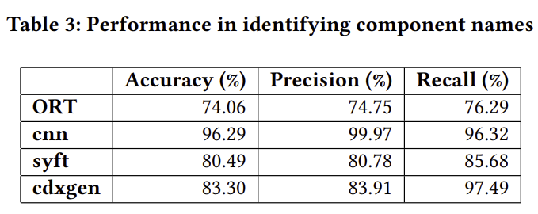
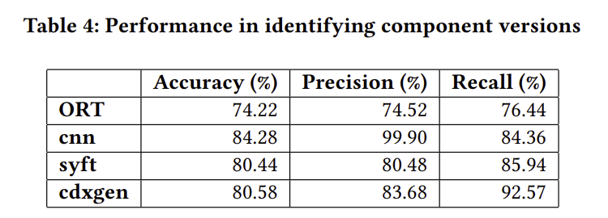
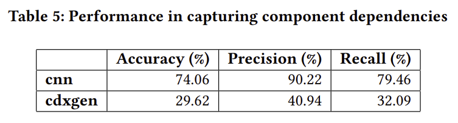

# 논문 리뷰

## 1. Introduction

- 소프트웨어 개발은 오픈소스 소프트웨어와 써드파티 종속성의 광범위한 활용으로 큰 변화를 겪음.
    - 개발자들은 개발의 가속을 위해 기존의 코드나 라이브러리 등 종속성을 자주 사용함.
    - 그러나, 이러한 의존성은 보안, 라이센싱, 취약점 관리, 그리고 공급망 관리 측면에서 심각한 문제를 야기할 수 있음
- SBoM ; 소프트웨어에 포함된 모든 구성 요소, 라이브러리, 종속성을 나열해주는 기초적 청사진 역할.
    - 공격자가 주요 소프트웨어 구성요소 뿐만 아니라 써드파티와 종속성의 취약점을 노리는 사례가 많음
    - 이에 대응하는 핵심 도구로 자리잡음
- Docs가 부족한 레거시 프로젝트는 SBoM 작성을 위해 직접 코드를 분석하거나, 원 개발자의 자문에 의존해야 함
    - 때문에 SBoM을 자동으로 생성할 수 있는 도구가 필요함
- 그러나 대부분의 패키지는 자동 SBoM 생성은 기술적으로 매우 까다로움.
    - 원인: 복잡한 종속성과 코드 난독화, 잦은 업데이트
- 또한 SBoM에 대한 단일 표준이 없음.
    - 때문에 SBoM 생성 도구는 다양한 표준에 유연하게 대응해야 함.

## 2. Methodology

- 연구 흐름: 도구 & 프로젝트 선정 → SBoM 생성 → 기준 데이터 구축 → 매트릭 기반 비교 분석
1. SBoM 생성 도구 선정
    1. 초기 검색 결과인 36개의 프로젝트 중 아래 조건을 만족하는 프로젝트만 골라냄.
        1. CycloneDX 포맷의 SBoM을 생성할 수 있는가?
        2. JS npm 프로젝트를 지원하는가?
        3. 스크립팅과 자동화를 위한 커맨드라인 기능을 지원하는가?
    2. 최종적으로 ORT, cnn, Syft, cdxgen 총 4개의 프로젝트를 선정함.
2. 대상 프로젝트 선정
    1. 아래 조건을 만족하는 프로젝트를 검색함.
        1. package-lock.json을 포함하는가?
        2. yarn.lock이나 pnpm-lock.yaml 등 타 패키지 매니저의 lock 파일을 포함하지 않는가?
    2. 그 중 스타를 많이 받은 쪽에 가중치를 두어, 총 50개의 npm 프로젝트를 선정함.
3. 각 프로젝트에 대해, 총 4개의 SBoM 생성 도구를 각각 적용함.
    - ORT를 제외하면 모두 json 형태로 생성하지만, ORT는 XML 형태로 SBoM을 생성함.
    - 데이터 형식의 일관성을 위해 ORT의 결과물을 json으로 변환하는 python 스크립트를 작성함.

### 매트릭 기반 비교 분석

- 생성된 SBoM에서 추출한 컴포넌트 이름과 버전을 미리 제작한 정답과 비교
- 정확도, 정밀도, 재현율 계산
    - 정확도, 정밀도, 재현율에 대한 개요
        - 변수 개요
            - TP (True Positives): 정확하게 식별된 컴포넌트
            - FP (False Positives): 부정확하게 식별된 컴포넌트
            - FN (False Negatives): 식별되지 않은 컴포넌트
        - 정확도: 전체 컴포넌트 중 정확하게 식별된 컴포넌트의 비율 ( = $TP \over TP + FP + FN$ )
        - 정밀도: 식별된 컴포넌트 중 정확하게 식별된 컴포넌트의 비율 ( = $TP \over TP + FP$ )
        - 재현율: 실제 컴포넌트 중 식별된 컴포넌트의 비율 ( = $TP \over TP + FN$ )

## 3. Performance Evaluation

- SBoM 생성 도구의 핵심 요소 : 컴포넌트 이름 식별 // 각 컴포넌트의 버전 식별 // 컴포넌트간 의존성 상세 기술
    - 포괄적 비교를 위해 위에서 정의한 정확도, 정밀도, 재현율 3가지를 각 요소에 대해 계산하여 활용함.

- 컴포넌트 이름 식별 능률
    - 전반적으로 cnn이 다른 도구들에 비해 압도적인 수치의 정확도와 정밀도를 보임. 또한 재현율도 매우 높았음.

- 컴포넌트 버전 식별 능률
    - cnn이 재현율은 syft와 cdxgen에 밀리지만, 이름 식별 부분과 비슷하게 매우 높은 정확도와 정밀도를 보임.

- 컴포넌트간 의존성 기술 능률
    - ORT와 syft의 경우 해당 기능을 제공하지 않기에 통계에서 제외함.
    - cnn이 정확도와 정밀도, 재현율 모두에서 cdxgen을 압도함.

## 4. Conclusion

- ORT, cnn, syft, cdxgen 총 4개 도구를 총 50개의 npm 프로젝트에 적용해봄.
- 연구 결과 cnn이 4개 도구 중 가장 우수한 성능을 보임.
