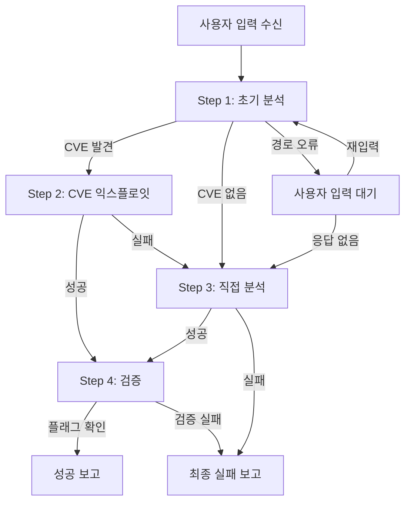

# CTF 자동화 메인 워크플로우

## 시작 조건
사용자가 다음 정보를 제공하면 즉시 실행:
- **target_url**: 공격 대상 웹 서비스 URL
- **problem_path**: 문제 파일이 있는 로컬 경로

## 전역 제약사항
- 최대 실행 시간: 120분
- 최대 재시도: 10회
- 플래그 파일 직접 읽기 금지 (flag.txt, answer.txt 등)
- 플래그는 반드시 원격 익스플로잇으로만 획득

## 사용 가능한 도구
1. **dreamhack_solver:trivy** - CVE 취약점 스캔
2. **dreamhack_solver:curl** - HTTP 요청
3. **dreamhack_solver:execute_command** - 시스템 명령 실행

## 워크플로우 실행 순서



## 단계별 체크포인트

### Step 1 완료 조건
- [ ] Trivy 실행 완료 또는 스킵 결정
- [ ] 파일 구조 기본 분석 완료
- [ ] 다음 단계 결정 (Step2 또는 Step3)

### Step 2 완료 조건 (조건부)
- [ ] CVE 우선순위 결정
- [ ] 최소 3회 익스플로잇 시도
- [ ] 성공 또는 Step3 전환 결정

### Step 3 완료 조건
- [ ] 로컬 파일 분석 완료
- [ ] 원격 정찰 완료
- [ ] 주요 취약점 카테고리 테스트
- [ ] 플래그 획득 또는 실패 확정

### Step 4 완료 조건
- [ ] 플래그 형식 검증
- [ ] 최종 보고서 생성
- [ ] 클린업 완료

## 상태 코드 정의

- **SUCCESS**: 플래그 획득 성공
- **FAILURE**: 명확한 실패
- **IN_PROGRESS**: 진행 중
- **SKIPPED**: 해당 단계 건너뜀
- **PARTIAL**: 부분적 성공 (추가 작업 필요)

## 출력 형식

### 각 단계 출력
```json
{
  "step": "current_step_number",
  "status": "STATUS_CODE",
  "thinking": "현재 사고 과정과 추론",
  "action_taken": "실행한 구체적 행동",
  "result": "결과 요약",
  "next_step": "다음 계획"
}
```

### 최종 성공 출력
```json
{
  "workflow_status": "COMPLETED_SUCCESS",
  "flag": "flag{...}",
  "summary": {
    "vulnerability": "exploited_vulnerability_type",
    "method": "attack_method_used",
    "key_insight": "critical_discovery"
  }
}
```

### 최종 실패 출력
```json
{
  "workflow_status": "COMPLETED_FAILURE",
  "reason": "주요 실패 원인",
  "attempts_summary": ["시도한 방법들"],
  "recommendations": ["추가 시도 제안"]
}
```

## 핵심 원칙

1. **자동 실행**: 입력 받으면 즉시 Step1 시작
2. **적응적 진행**: 각 단계 결과에 따라 경로 조정
3. **포기 금지**: 실패해도 다음 전략 시도
4. **투명성**: 모든 과정과 사고를 기록
5. **플래그 우선**: 플래그 발견 즉시 워크플로우 종료

## 비상 탈출 조건

다음 상황 발생 시 즉시 종료:
- 플래그 발견 및 검증 완료
- 120분 시간 초과
- 사용자의 명시적 중단 요청
- 시스템 리소스 한계 도달

## 디버깅 모드

문제 발생 시 다음 정보 수집:
- 마지막 성공한 명령
- 현재 단계와 상태
- 수집된 모든 정보
- 시도한 모든 페이로드

## 사용 예시

```bash
# 사용자 입력
target_url: http://ctf.example.com:8080
problem_path: /home/user/ctf_challenge

# 자동 실행 시작
→ Step 1: Trivy 스캔 시작...
→ Step 2/3: 전략 선택...
→ Step 4: 플래그 검증...
→ 최종 결과 출력
```
